# Convolution-augmented Transformer for Speech Recognition—翻译

### Abstract

最近基于Transformer和CNN的模型在ASR中变现非常出色，胜过循环神经网络(RNNs)。Transformer模型非常擅长捕获基于内容的全局信息，而CNN则能非常有效的利用本地特征。在这篇论文中，我们通过研究如何结合CNNs和Transfomers以parameter-efficient的方式，对音频序列的局部和全局依赖进行建模，从而实现了两全其美。为此我们提出了一种用于语音识别的convolution-augmented trans- former(卷积增强Transformer)，名为：Conformer。Conformer大大优于以前的基于Transformer和CNN的模型，从而实现了最新的精度。在广泛使用的LibriSpeech基准测试中，我们的模型在不使用语言模型的情况下达到2.1％ / 4.3％的WER，在test/test other数据集上使用外部语言模型时达到1.9％ / 3.9％的WER。我们还观察到只有10M参数的小型模型的竞争性能为2.7％/ 6.3％。

### 1. Introduction

近年来，基于神经网络的端到端自动语音识别（ASR）系统已经取得了很大的进步 [1, 2, 3, 4]。递归神经网络（RNN）已成为ASR的实际选择，因为它们可以有效地对音频序列中的时间依赖性进行建模[5]。最近，基于自我注意力的Transformer架构[6，7]由于具有捕获长距离交互的能力和较高的训练效率，因此在建模序列中得到了广泛的采用。另外，对于ASR [8、9、10、11、12]，卷积也是成功的，它通过一层局部的接收场逐步捕获局部上下文。但是，具有自我注意或卷积的模型各有其局限性。尽管Transformer擅长于对远程全局环境进行建模，但它们提取细粒度的局部特征图案的能力却较弱。另一方面，卷积神经网络（CNN）利用本地信息，并被用作视觉中的实际计算模块。他们在local window上学习共享的基于位置的内核，这些内核保持平移等方差，并且能够捕获诸如边缘和形状之类的特征。使用local connectivity的限制是需要更多的层或参数来捕获全局信息。 为了解决这个问题，在Con-textNet [10] 选用 the squeeze-and-excitation module [13]来捕获更长的上下文信息，但是，它在捕获动态全局上下文时仍然受到限制，因为它仅对整个序列应用全局平均。

最近的工作表明，结合卷积和自我注意会比单独使用它们效果更好[14]。总之，他们既能够学习position-wise local features(位置方面的本地特征)，也能够使用use content-based global interactions(基于内容的全局信息)。同时，诸如[15，16]之类的论文通过保持相对方差的基于相对位置的信息增强了自我注意力。Wu et al. [17] 提出了一种多分支体系结构，将输入分为两个分支self-attention and convolution并且合并他们的输出。 他们的工作针对移动应用程序，并显示了在机器翻译任务中有改进。

我们研究了如何在ASR模型中将卷积与自我注意有机结合。我们假设全局和局部交互对于提高参数效率都很重要。为了实现这一目标，我们提出了一种新的自我注意和卷积相结合的方法，将实现两全其美–自我注意会学习全局交互作用，而卷积会有效地捕获基于相对偏移的局部相关性。受Wu et al. [17, 18]的启发，我们介绍了一种新的自我注意和卷积的组合，夹在一对前馈模块之间，如图1所示。

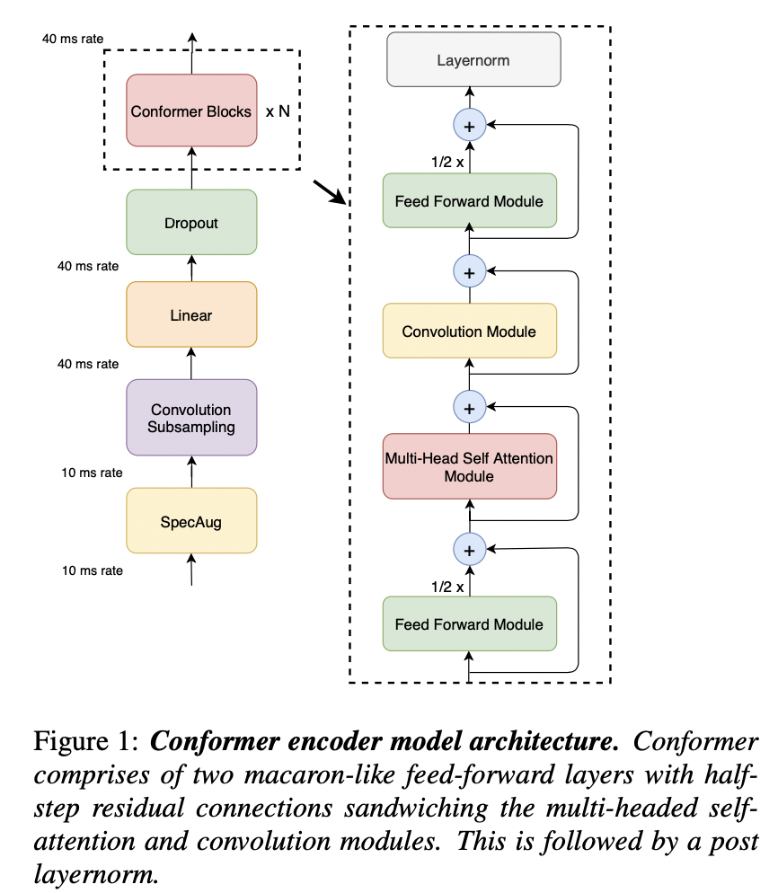

 我们命名Conformer的模型，在LibriSpeech的数据集上获得了最新的结果，优于之前使用 external language model，在test other 数据上发布的，最佳模型TransformerTransducer。相对改进了15%。我们基于模型参数限制条件提出了三种模型，10M，30M和118M。10M的模型，与类似大小的模型相比，在test/test other的数据集上占2.7%/6.3%。30M的模型已经超越了 使用139M参数的模型outperforms Transformer[7]。使用大的118M参数模型，我们能够实现不使用语言模型的情况下为2.1％/ 4.3％，使用语言模型的情况下为1.9％/ 3.9％。

我们进一步仔细研究注意头数量，卷积核大小，激活函数，前馈层的放置以及不同策略的影响。将卷积模块添加到基于Transformer的网络中，并阐明每种技术如何有助于提高准确性。

### 2. Conformer Encoder

Audio encoder 首先使用 convolution subsampling layer 处理输入，然后使用大量的Conformer块处理输入，如图1所示。我们模型的独特功能是使用Conformer块代替Transformer块，如[7,19]。

一个Conformer block是由堆叠在一起的四个模块组成，即 feed-forward module， self-attention module， convolution module 和两个 feed-forward module在最后。在2.1和2.3节中分别介绍了， self-attention 模块和 convolution 模块和feed-forward模块。最后，2.4描述了这些子模块是如何组合的。

***2.1. Multi-Headed Self-Attention Module***

我们采用多头自我注意（MHSA），同时整合了Transformer-XL [20]的一种重要技术，即相对正弦位置编码方案。相对位置编码允许自我注意模块更好地融合不同的输入长度，并且所得的编码器对于utterance length的变化更加鲁棒。我们使用带有缺失的prenorm残差单位[21，22]来帮助训练和规范化更深层的模型。

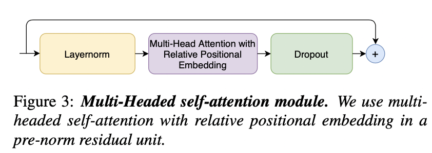

***2.2. Convolution Module***

受[17]的启发，卷积模块从门控机制[23]开始——pointwise convolution和门控线性单元（GLU）。 随后是单个一维深度卷积层。 在卷积之后立即部署Batchnorm以帮助训练深度模型。  图2说明了卷积块。

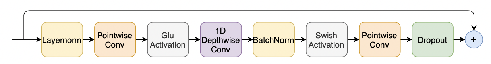

> **图2：卷积模块。 卷积模块包含一个Pointwise Conv，**其扩展因子为2，投射出GLU激活层的通道数量，然后是1D DepthWise Conv。 1D DepthWise Conv后跟一个Batchnorm，然后是一个激活层。

***2.3. Feed Forward Module***

在文献[6]中提出的Transformer架构在MHSA层之后部署了一个feed-foward模块，由两个线性Transformer和一个介于两者之间的非线性激活组成。在feed-forward层上添加了残差连接，然后进行 layer normalization.。Transformer ASR模型[7，24]也采用了这种结构。

我们遵循规范前的残差单位[21，22]，并在残差单位内和第一线性层之前的输入上应用层归一化。  我们还应用Swish activation和Dropout，这有助于规范网络。 图4说明了前馈（FFN）模块。

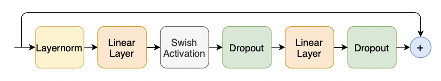

>**图4：前馈模块。** 第一线性层使用4的膨胀因子，第二线性层将其投影回到模型尺寸。 我们在前馈模块中使用swish激活和pre-norm 残差单元。

***2.4. Conformer Block***

我们提出的Conformer模块包含两个前馈模块，这些模块将多头自注意力模块夹在中间和卷积模块，如图1所示。这种三明治结构受到Macaron-Net [18]的启发，该提议将Transformer模块中的原始前馈层替换为两个半步前馈层，一个在 attention 之前，另一个在 attention 层之后。如Macron-Net中一样，我们在前馈（FFN）模块中采用半步剩余权重。第二个前馈模块后面是最后一个 LayerNorm层。 从数学上讲，这意味着，对于导Conformer 块 i 的输入 input xi , 该block的输出yi 为：

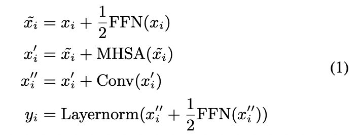

FFN表示前馈模块,MHSA表示Multi-Head Self-Attention 模块，Conv表示卷积模块。

我们在3.4.3节中讨论，比较Macaron-style half-step FFNs 和之前我们研究的 vanilla FFN。我们发现，具有 half-step residual connections 将注意力和卷积模块夹在中间的两个Macaron-net style feed-forward layers，与在Confomer体系结构中使用单个前馈网络相比，有了显著的改进。

卷积和自我注意的结合的方法在之前已经被研究过，并且尝试过这种架构的许多方法。在3.4.2节中研究了通过自注意力增强卷积的不同选择。我们发现，在自注意力模块之后堆叠的卷积模块最适合语音识别。

### 3. Experiments

***3.1. Data***

我们在LibriSpeech [26]数据集上评估提出的模型，该数据集由970个小时的标记语音和一个用于构建语言模型的附加800M word token，纯文本语料库组成。我们提取了一个25毫秒窗口（跨度为10毫秒）计算出的80通道滤波器组特征。  我们将SpecAugment [27，28]与mask parameter (F = 27)和ten time masks with maximum  time-mask ratio(pS =0.05), 其中 time mask的maximum-size，设置为pS乘以the length of the utterance。

***3.2. ConformerTransducer***

通过分析网络深度，模型尺寸，attention heads的不同组合并在模型参数大小约束内选择性能最佳的一个组合，我们分别确定了分别具有10M，30M和118M参数的三个模型(小型，中型，大型)。我们在所有模型中都使用单个LSTM层解码器。表1描述了他们的体系结构的超参数。

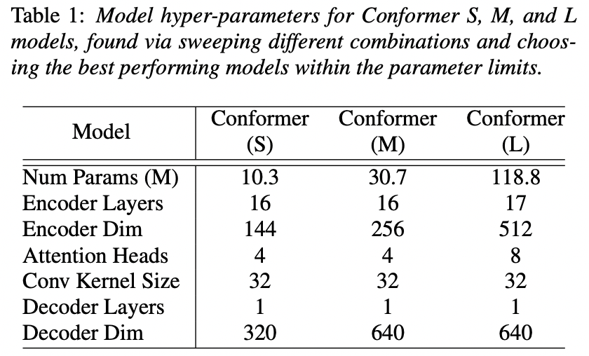

为了进行正则化，我们在Conformer每个残差单元中都将dropout[29]应用于每个模块的输出，然后再将其添加到模块输入中。我们使用Pdorp = 0.1的比率。Variational noise[5,30]作为正则化引入模型。 网络中所有可训练的权重也添加了权重为1e-6的L2正则化。我们使用Adam优化器[31]训练模型，其中β1= 0.9，β2= 0.98和ε= 10−9以及 Transformer 学习率表[6]，其中10k warm-up steps和peak 学习率 0.05/d^0.5, d是conformer encoder 模型尺度。

我们使用在LibriSpeech语言模型语料库上训练的宽度为4096的3层LSTM语言模型（LM），并添加了LibriSpeech 960h transcripts，并标记了从LibriSpeech 960h构建的1K的WPM。LM在 dev-set transcript上具有word-level perplexity 63.9。通过网络搜索在开发集上调整用于浅层融合的LM权重λ。所有模型都使用Lingvo toolkit [32]实现。

***3.3. ResultsonLibriSpeech***

表2将我们在LibriSpeech test-clean/test-other 上模型的WER结果与一些最新模型进行了比较，这些模型包括：ContextNet [10]，Transformer换能器[7]和QuartzNet [9]。我们所有的评估结果都将小数点后四舍五入到1位。

如果没有语言模型，我们的 medium 模型在 test/test other上的新能已经打到2.3/5.0的优异结果。胜过最著名的Transformer，基于LSTM的模型或类似大小的卷积模型。添加语言模型后，我们的模型在所有现有模型中实现了最低的单词错误率。 这清楚地证明了在单个神经网络中结合使用Transformer和卷积的有效性。

	>表2：Conformer与最近发布的模型的比较。我们的模型显示出对各种模型参数大小约束的一致改进。在参数为1030万时，与同期工作ContextNet（S）相比，我们的模型在test other上要好0.7％。在模型参数为30.7M的情况下，我们的模型已经大大优于具有139M参数的Transformer Transducer [7]先前发布的最新技术成果。

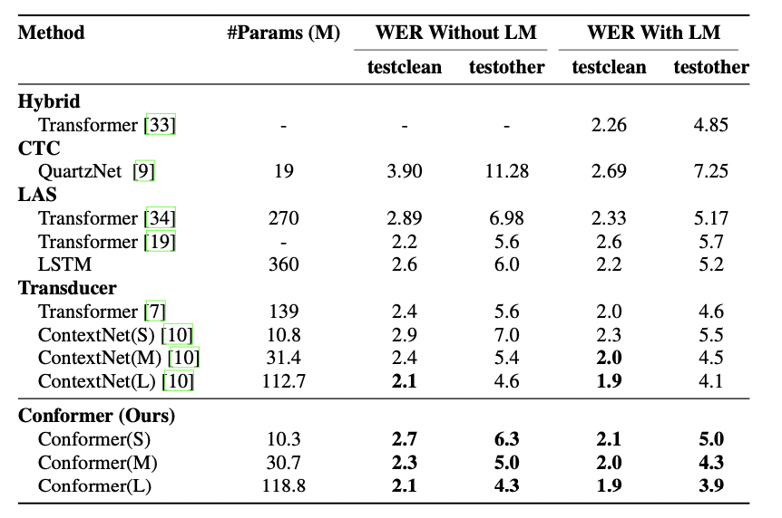

**3.4. AblationStudies**

***3.4.1. Conformer Block vs.TransformerBlock***

​	Conformer block在很多方面与Transformer block不同，特别是包含卷积块，并使用Macaron-style, 一对FFNs围绕着该block。下面，我们通过将一个Conformer块向一个Transformer块进行变异来研究这些差异的这些影响，同时保持参数的总数不变。 表3显示了每个更改对Conformer块的影响。在所有差异中，convolution sub-block 是最重要的功能，而Macaron-style的FFN对也比相同数量参数的单个FFN更有效。使用 swish activations 收敛更快。

> 表 3: 拆解 Conformer 。从Conformer块开始，我们删除其功能，朝向普通的Transformer block：(1) 用ReLU代替SWISH；（2）去除卷积子块； （3）用单个FFN代替Macaron型FFN对；（4）用普通的自我注意层[6]替代带有相对位置嵌入[20]的自我注意。 所有消融研究结果均在没有外部LM的情况下进行评估。

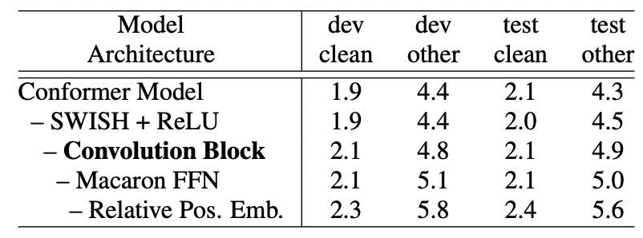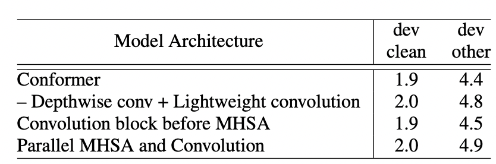

***3.4.2. Combinations of Convolution and Transformer Modules***

我们研究了将多头自注意力（MHSA）模块与卷积模块相结合的各种不同方式的效果。 首先，我们尝试用轻量级的卷积替换卷积模块中的深度卷积[35]，发现性能显着下降，特别是在 dev- other 其他数据集上。 其次，我们研究了在我们的Conformer模型中将卷积模块放在MHSA模块之前，发现在dev-other上它将卷积模块的结果降低0.1。该体系结构的另一种可能的方式是将输入分为多头自注意力模块和卷积模块的并行分支，并按[17]中的建议将其输出串联在一起。我们发现，与我们提出的体系结构相比，这会降低性能。

表4中的这些结果表明了将卷积模块放在Conformer块中的自注意模块之后的优势。

>**表4：Conformer注意卷积块的分别研究**。改变卷积 block 和 multi-headed self attention：(1) Conformer结构 （2）使用轻量级的卷积代替深度卷积 （3）卷积块在多头自注意力之前。（4）卷积和MHSA与他们的输出串联在一起[17]。

***3.4.3. Macaron Feed Forward Modules***

代替Transformer模型中的关注块发布单个前馈模块（FFN），Conformer模块具有一对 macaron-like 的前馈模块，将自注意力和卷积模块夹在中间。此外，Conformer 前馈模块与half-step residuals一块使用。表5中展示了单个FFN或 full-step residuals对Conformer块的影响。

> 表5：Macaron-net前馈模块的分解研究。分解Conformer 前馈模块与Transformer模型中使用的单个FFN之间的差异：(1) Conformer; (2) 在前馈模块中带有full-step residuals的Conformer。 （3）用单个FFN替代Macaron-style的FFN。

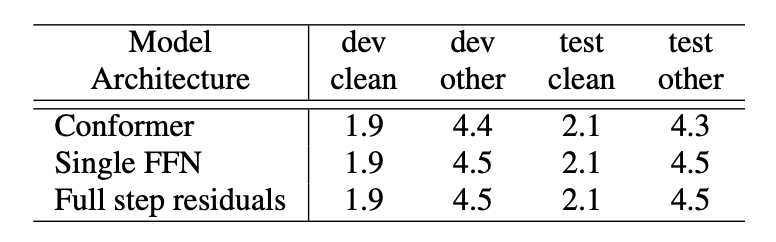

***3.4.4. Number of Attention Heads***

在self-attention, 每个attention头学习聚焦在输入的不同部分，从而有可能将预测提高导简单的加权平均值之外。我们进行实验，以研究在大型模型中将注意力头的数量从4改为32的效果，并在所有图层中使用相同数量的头。我们发现，将注意力提高到16位可以提高准确性，尤其是在dev other数据集上，如表6所示。

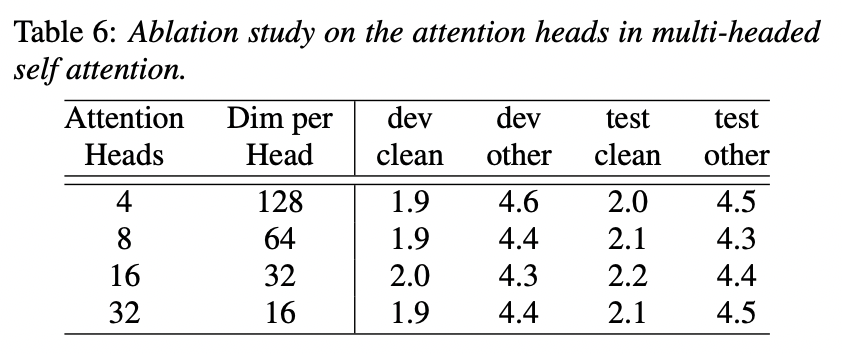

***3.4.5. Convolution Kernel Sizes***

为了研究卷积核大小在深度卷积中的影响，我们在大型模型的{3，7，17，17，32，65}中扫描内核大小，并对所有层使用相同的内核大小。我们分别使用{3，7，17，17，32，65}大小的卷积核惊醒卷积，并且所有层都是用相同大小卷积核。我们发现，直到内核大小为17和32为止，随着内核大小的增加，性能会有所提高，但是在内核大小为65的情况下，性能会下降，如表7所示。

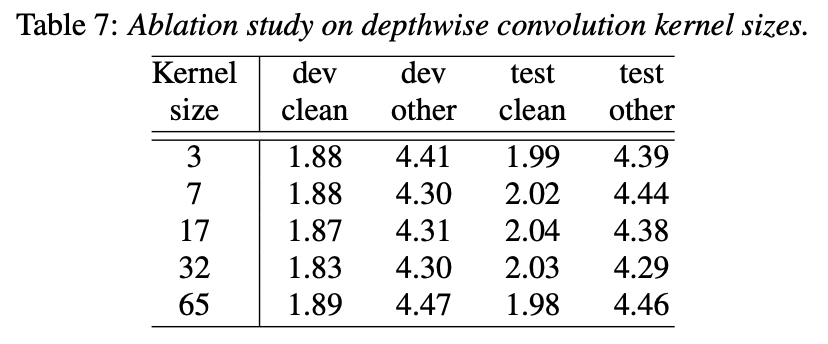

### 4. Conclusion

在这项工作中，我们介绍了Conformer，该结构集成了CNN和Transformer的组件以实现端到端语音识别。我们研究了每个组件的重要性，并证明了包括卷积模块对于Conformer模型的性能至关重要。与以前在LibriSpeech数据集上进行的工作相比，该模型具有更少的参数，显示了更高的准确性，并且以1.9％/ 3.9％的test/test other测试集上实现了最新的性能。

